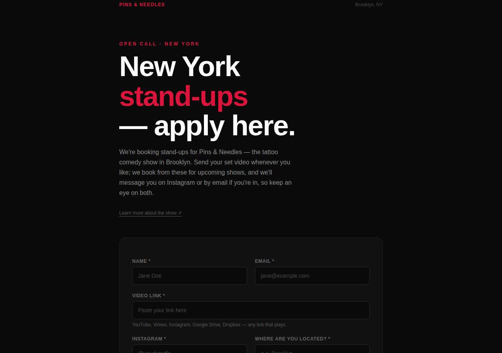
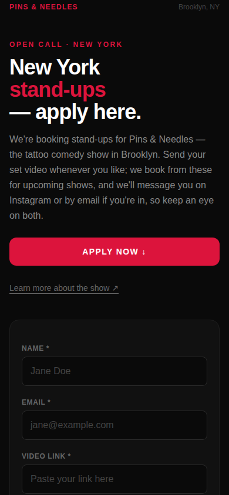
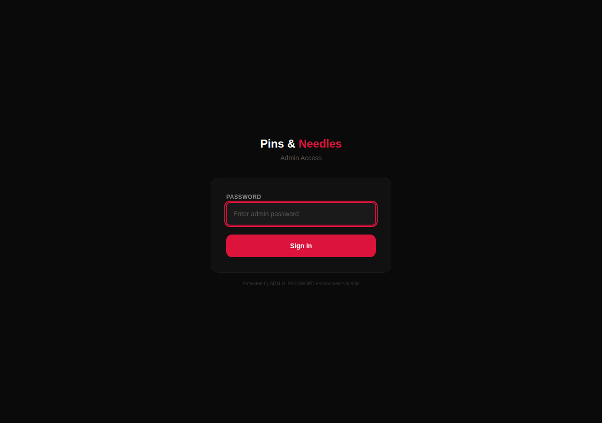

# Pins & Needles — Submissions

A full-stack submission and booking platform for **Pins & Needles**, a
recurring stand-up comedy show in Brooklyn, NY. Comedians apply through a
public form; the show runs entirely from an admin dashboard — triage
applicants, track them through a pipeline, book a lineup, print it, and email
everyone without leaving the browser.

Built and deployed on **entirely free infrastructure** — Vercel Hobby +
Vercel Postgres (Neon), with Vercel Blob as an optional add-on — while still
covering the things a real production app needs: input validation, image
handling, print output, and safe schema evolution.

<p align="center">
  <br>
  <sub>Public submission page</sub>
</p>

<p align="center">
  
  
  <br>
  <sub>Mobile-first form &nbsp;·&nbsp; Password-protected admin</sub>
</p>

---

## Why this project is interesting

It's a small app, on purpose — the interesting part is the constraints it
solves under a $0/month budget, without cutting corners on UX:

- **No email service.** Reaching out to a comedian doesn't queue a
  transactional email through a third-party API — the admin writes a
  reusable template with `{{placeholders}}`, previews it filled in for a
  real applicant, and it opens as a pre-filled draft in *their own* mail
  client (or copies to the clipboard). No sending domain, API key, or
  deliverability to manage, and every email genuinely comes from the
  organizer's own address.
- **No PDF library.** The booked lineup is a normal, printable web page.
  "Export as PDF" is the browser's own Save-as-PDF — correct pagination,
  page breaks that respect card boundaries, zero dependencies.
- **No auth provider.** A single admin, so a signed, `httpOnly`,
  `sameSite` cookie set by a Server Action is the entire auth system —
  simpler and more honest than bolting on OAuth for one user.
- **Self-migrating schema.** Every new column ships as
  `ALTER TABLE … ADD COLUMN IF NOT EXISTS`, run on first request. No
  migration runner, no manual `psql` step on deploy — and retired fields
  (an old festival's fixed dates, a dropped eligibility question) stay
  nullable on the type rather than being deleted, so historical
  submissions keep rendering correctly instead of being silently
  truncated.
- **Client-side image pipeline.** Phone headshots routinely arrive at
  5–12 MB. Rather than reject them, the form decodes, downscales, and
  re-encodes the image in the browser via `<canvas>` before it ever
  leaves the device — no server-side image processing, no extra
  infrastructure.
- **Real mobile ergonomics**, not just a responsive breakpoint: safe-area
  insets for notches, ≥44px tap targets throughout, inputs sized to avoid
  iOS's auto-zoom-on-focus, and a localStorage draft that survives a
  comedian tabbing away to go copy their video link.

## Features

**Public submission page** (`/`)
- Collects name, email, video link, Instagram, location, headshot, and a
  short-answer question — all validated with per-field, plain-English
  errors (not a browser's generic "please fill out this field")
- Accepts a video link in *any* shape (`youtube.com/...`, a bare domain,
  an Instagram reel) and normalizes it into a safe, clickable URL —
  or shows it as plain text rather than a broken link if it isn't one
- Headshots are resized client-side before upload; the form degrades
  gracefully (headshot optional) when Blob storage isn't configured
  Server Actions validate everything server-side too — client checks
  are a UX convenience, not the security boundary
- Autosaves a draft to `localStorage` and restores it on return
- Toggle the whole page to "Applications Closed" via an env var, with an
  optional deadline notice — no code change needed for an off-season

**Admin dashboard** (`/admin`, password-protected)
- Applicants and Booked tabs, with Declined tucked behind its own filter
  card so it never clutters the working list
- Instant search across name, email, Instagram, location, notes, and
  questions (press `/` from anywhere to jump to it), plus sort and
  status-filter stat cards
- One-tap status pipeline (`new → reviewed → contacted → booked →
  declined`) with optimistic UI that rolls back cleanly on a failed save
- Dense, sticky-header desktop table that never scrolls sideways; a
  card layout on mobile — same data, laid out for the device
- Per-submission notes that don't lose an in-progress edit if a save
  fails, and a two-step delete that also cleans up the uploaded headshot
- **Booked tab**: a collapsible contact list (name + email per booked
  comedian) with one click to copy the whole list to the clipboard

**Booked lineup** (`/admin/lineup`)
- A print-first document — the "export" *is* printing to PDF from the
  browser, one comedian per card, correctly paginated

**Email templates** (`/admin/templates`)
- Reusable templates with `{{first_name}}`, `{{video}}`, `{{ref}}`, and
  other placeholders
- Live preview against any real submission (or a sample one), flagging
  blank placeholders, typo'd tokens, and bodies too long for a `mailto:`
  link before you send
- Warns before discarding an unsaved edit when switching templates

## Tech stack

| | |
|---|---|
| Framework | [Next.js 16](https://nextjs.org) (App Router, Server Actions — no separate API layer) |
| UI | React 19, Tailwind CSS v4 |
| Database | Vercel Postgres (Neon), accessed via `@vercel/postgres` |
| File storage | Vercel Blob (optional — headshot uploads) |
| Language | TypeScript, `strict` mode |
| Linting | ESLint (`eslint-config-next`) |
| CI | GitHub Actions — lint + build on every push and PR |

## Getting started

```bash
git clone https://github.com/taylordrew4u2/comedysub.git
cd comedysub
npm install
cp .env.example .env.local   # then fill in ADMIN_PASSWORD at minimum
npm run dev
```

- Public page: <http://localhost:3000>
- Admin dashboard: <http://localhost:3000/admin>

See [`.env.example`](.env.example) for every variable and what it does. Only
`ADMIN_PASSWORD` and a Postgres connection are required to run the app;
everything else (headshot uploads, the venue/time strip, the closing-date
notice) is an optional enhancement that no-ops when unset.

### Deploying (free tier)

1. **Push to GitHub**, then [import the repo into Vercel](https://vercel.com/new) — the Next.js framework preset is auto-detected.
2. **Add a database**: Vercel project → **Storage** → **Create Database** → **Postgres** (Neon, free tier). Vercel injects the `POSTGRES_*` env vars automatically.
3. **Set environment variables**: Vercel project → **Settings** → **Environment Variables** → add `ADMIN_PASSWORD` (required) and any optional variables from `.env.example`.
4. **Redeploy.** The `submissions` and `email_templates` tables are created automatically on first request, and schema changes apply themselves the same way — there's no migration step to run.

## Project structure

```
app/
├── layout.tsx                    Root layout, metadata, viewport
├── page.tsx                      Public submission page
├── globals.css                   Global styles (dark theme, safe-area helpers)
├── actions.ts                    Server Actions — submit, login, status, notes, templates
├── lib/
│   ├── db.ts                     Postgres queries, self-migrating schema, types
│   ├── normalize.ts              Turns pasted links/handles into safe hrefs
│   └── emailTemplate.ts          {{placeholder}} rendering + mailto links
├── _components/
│   └── WebForm.tsx                Comedian submission form (client) — validation, drafts, image resize
└── admin/
    ├── page.tsx                  Admin entry (server) — auth check, DB error state
    ├── LoginForm.tsx              Admin login (client)
    ├── AdminDashboard.tsx         Dashboard: search, sort, tabs, status pipeline (client)
    ├── lineup/                    Printable booked lineup
    └── templates/                 Email template editor + live preview
```

## Testing this locally

```bash
npm run lint    # ESLint
npm run build   # Full production build + TypeScript check
```

CI runs both on every push and pull request (see
[`.github/workflows/ci.yml`](.github/workflows/ci.yml)).

## License

[MIT](LICENSE)
